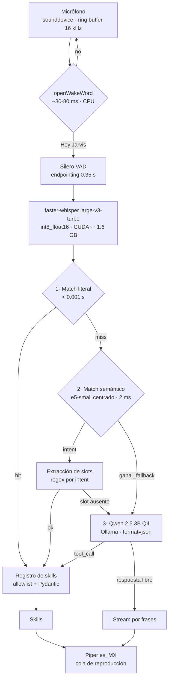

# Arquitectura

## El problema

Un asistente de voz se siente instantáneo o no se usa. El objetivo es
sub-segundo desde que dejas de hablar hasta que empieza a sonar la respuesta,
con todo corriendo en local (RTX 8 GB) y en español.

## Flujo



## Presupuesto de VRAM

| Componente | VRAM |
|---|---|
| Whisper large-v3-turbo (int8_float16) | ~1.6 GB |
| Qwen 2.5 3B Instruct (Q4_K_M) | ~2.5 GB |
| e5-small | CPU (~2 ms, no merece ocupar VRAM) |
| openWakeWord + Silero VAD + Piper | CPU |
| **Total** | **~4.1 GB** de 8 GB |

Sobran ~3.9 GB: hay margen para subir a Qwen 7B Q4 si la calidad del fallback
no alcanza.

---

## Decisiones

### Moonshine se descartó: es solo inglés

El stack inicial contemplaba Moonshine tiny (~50 ms). No tiene modelo en
español y no lo va a tener. `faster-whisper` con `large-v3-turbo` es el
reemplazo: más lento (0.12–0.25 s) pero es la única opción real, y la precisión
del STT marca el techo de todo lo demás — una palabra mal transcrita es un
comando mal enrutado.

### El LLM no está en la ruta crítica

Un LLM de 3B cuesta 0.25–0.50 s por consulta y confunde intenciones parecidas.
"Siguiente canción" no necesita razonamiento: necesita un lookup. El router
resuelve en tres etapas de coste creciente y el LLM solo ve lo que las dos
primeras no supieron.

**La métrica que gobierna la latencia media del sistema es el porcentaje de
turnos con `stage=llm`.** Si sube del 15%, al catálogo le faltan paráfrasis.

### El fuzzy matching de strings no servía

"Pasa la canción" y "siguiente canción" no comparten casi ningún carácter.
RapidFuzz les da un score bajo, así que el comando más frecuente habría caído
sistemáticamente en la ruta más lenta. Por eso la etapa 2 compara *significados*
con embeddings, no cadenas.

### Un umbral absoluto de coseno tampoco funcionaba

Fue el hallazgo que obligó a rediseñar. Medido contra este catálogo con
`intfloat/multilingual-e5-small`:

| | rango de scores |
|---|---|
| Positivos (comandos reales) | 0.856 – 0.963 |
| Negativos (charla, preguntas) | 0.809 – **0.903** |

**Se solapan.** e5 comprime todas las similitudes en una banda alta y estrecha,
así que ningún umbral separa un comando de una pregunta abierta. Dos cambios lo
arreglaron:

**1. Centrado** (`Catalog.project`). Restar el centroide del catálogo elimina la
dirección común que infla todos los cosenos. El rango útil se abre a 0.19–0.73.

**2. Clase negativa** (`_fallback` en `commands.yaml`). En vez de preguntar
"¿supera el umbral?", se pregunta "¿se parece más a un comando o a una
conversación?". La decisión pasa a ser relativa —comparación entre clases— en
lugar de absoluta, y se ajusta de forma declarativa: si una pregunta abierta se
ejecuta como comando, se añade a los ejemplos del fallback.

Resultado tras el cambio: **24/24 positivos y 8/8 negativos** correctos, con
márgenes amplios (ganador 0.34–1.00 frente a un segundo clasificado muy por
debajo). El umbral sigue existiendo pero solo como red de seguridad.

### `open.target`: apps y webs son un solo intent

Separar `app.open` de `web.open` fallaba de forma medible: "ábreme el chrome"
ganaba `web.open` con 0.942 frente a `app.open` con 0.922. Los embeddings no
tienen forma de saber si "chrome" es un programa o un sitio, porque **la
ambigüedad no es semántica sino de resolución**.

Se decide con datos en vez de con similitud:

```
allowlist de apps  →  mapa de sitios  →  búsqueda web
```

El último escalón garantiza que el comando nunca se queda sin efecto.

### El volumen del PC y el de Spotify: un slot, no dos intents

Mismo razonamiento que `open.target`, aplicado a un caso más agudo. *"Sube el
volumen"* y *"sube el volumen de Spotify"* comparten casi todas las palabras;
partirlas en dos intents las haría indistinguibles por coseno. Hay **un intent
por dirección** (subir, bajar, fijar, silenciar, consultar) y el destino viaja
como slot `target`, que por defecto vale `system`.

Cada destino tiene su mecanismo, y no se cruzan:

```
Spotify:  Web API  (el mando de dentro de la app)          — sin alternativa
PC:       IAudioEndpointVolume  →  teclas multimedia
```

Windows ofrece un segundo mando por aplicación (`ISimpleAudioVolume`, la barra
del mezclador) que **se llegó a usar para Spotify y se quitó**: es instantáneo y
no necesita autenticación, pero no es el mando que la gente quiere decir. Solo
afecta a lo que este PC saca por los altavoces, no se refleja en Spotify y no se
sincroniza con el móvil. Se paga un viaje de red por hacerlo bien.

**No hay degradación de Spotify al mezclador**, aunque sería fácil. Un fallback
que cambia *otro* volumen distinto del pedido es peor que un fallo: algo se
mueve, así que parece que funcionó.

El volumen del PC sí degrada a teclas, porque ahí ambos mecanismos mueven
exactamente el mismo mando; la única diferencia es la precisión (las teclas van
de 2% en 2%).

**Con número se fija, sin número se da un paso.** Y eso no depende de qué intent
gane: medido, *"sube el volumen al 50"* gana `volume.up` (0.635) y no
`volume.set`, porque el verbo pesa más que el número. En vez de pelear con el
router, los dos intents extraen el nivel y la skill lo prefiere sobre el paso —
la duda del router deja de tener consecuencias.

Coste medido de anclar el destino: *"termina el spotify"* se fue a `volume.mute`
(0.532 contra 0.357 de `app.close`) en cuanto se añadió *"silencia spotify"* al
catálogo. Cerrar una aplicación y silenciarla son cosas muy distintas y el
encoder no lo sabía: hubo que anclar el otro lado (`termina spotify`, `mata
spotify`), y quedó en 0.641 contra 0.524. **Es el mismo patrón que las
negaciones y las formas enclíticas: al anclar un lado, hay que medir el
opuesto.**

### Los slots se extraen después de decidir el intent

Los embeddings clasifican intenciones; no extraen parámetros. Una vez el intent
está decidido, un regex propio del intent saca el argumento. Como los regex ya
no tienen que desambiguar nada, "pon" puede aparecer en `spotify.play` y en
`open.target` sin conflicto.

Si el regex no encuentra el argumento, **solo ese caso** escala al LLM — no toda
la categoría de comandos.

Los patrones de un intent se recorren **todos**, acumulando, y para cada clave
manda el primero que la rellena. Así un intent puede repartir sus argumentos en
regex independientes —*"pon el volumen de spotify al 45"* necesita uno para el
nivel y otro para el destino— sin cambiar el comportamiento donde varios
patrones son alternativas del mismo argumento.

### Cerrar una app: el proceso se busca, no se deduce

`app.close` mataba `<spec.process>.exe`, y ese campo es opcional y a menudo
falso. Tres formas de fallar, las tres en silencio:

- las apps de la Microsoft Store llegan del descubrimiento con `process=None`
  (no hay forma de sacarlo del AppID) y la skill se rendía antes de intentarlo,
  aunque casi todas corren como un `.exe` normal y visible;
- los `.lnk` del menú Inicio traen un nombre **adivinado** pegando el título
  ("Visual Studio Code" → `VisualStudioCode.exe`, que no existe: es `Code.exe`);
- cuando `taskkill` fallaba, su mensaje se tiraba y el usuario oía siempre "no
  estaba abierto", tanto si no lo estaba como si el nombre era incorrecto o el
  sistema denegaba el permiso.

Ahora se construye una lista de nombres plausibles a partir de la entrada de la
allowlist —`process`, comando, clave y alias— y se **cruza con los procesos
vivos** (`tasklist`). Se mata un nombre que existe, y si no hay coincidencia se
dice que no está abierto, que es una frase distinta y accionable.

La comparación es exacta salvo mayúsculas y extensión, **sin matching difuso**:
un acierto de más aquí no abre una ventana equivocada, mata un proceso ajeno.
`Steam` contra `SteamService` está lo bastante cerca como para que cualquier
umbral difuso acabe costando trabajo sin guardar.

La frontera de seguridad no cambia: todos los candidatos salen de la config,
nunca del texto transcrito. Lo hablado solo elige **qué entrada** se usa.

### La precedencia de la config cede cuando la config no funciona

Lo declarado a mano en `apps:` gana sobre lo descubierto, con una excepción: si
el comando escrito a mano **no se puede lanzar en esta máquina**, se sustituye
por el descubierto y se avisa por log.

La precedencia existe para respetar una decisión deliberada, no para defender un
valor que no funciona. El caso se dio: `config.yaml` trae
`spotify: {command: spotify}`, que depende de que Spotify registre su clave en
App Paths. Cuando no lo hace —o la instalación es de la Store— *"abre spotify"*
no encontraba nada, mientras el descubrimiento tenía el AppID correcto y lo
estaba tirando por ser "menos prioritario".

Solo se reemplaza el comando: los alias y el nombre de proceso escritos a mano
se conservan, porque son mejores que los deducidos.

### Spotify: hay dos cosas tuyas que la búsqueda pública no ve

`search()` mira el catálogo público, y ahí no está ni tu biblioteca ni tus
listas:

- **Tus playlists.** *"Pon mi playlist de gym"* buscaba "gym" en el catálogo y
  reproducía la primera coincidencia del mundo. Hay que pedirlas por
  `current_user_playlists` (con los permisos `playlist-read-private` y
  `playlist-read-collaborative`) y emparejarlas por nombre. El emparejamiento
  usa `token_set_ratio` y no `WRatio`: con este último, "rock" casaba al 90 con
  una playlist llamada "Rocky soundtrack" por ser subcadena.
- **Tus Me Gusta.** No son una playlist y no tienen `context_uri`: arrancarlos
  como contexto es un 404. Hay que leer `current_user_saved_tracks` y pasar la
  lista de URIs.

El artista viaja en su propio slot y cambia la búsqueda entera: con artista se
usan filtros de campo (`track:"X" artist:"Y"`) y se salta la cascada
playlist→álbum→canción, porque *"pon la canción X de Y"* no puede acabar en una
playlist llamada X.

El molde "pon la canción X de Y" necesitó **nueve anclas** en el catálogo. Lo
único estable de esa frase es la sintaxis: un título desconocido es casi ruido
para el encoder, y con tres anclas *"pon la canción labios compartidos de maná"*
ganaba a `spotify.like` por 0.012 — perder ahí no habría sido un "no entiendo",
sino guardar en favoritos la canción que ya sonaba.

### `SendInput` y el tamaño de `INPUT`

`SendInput` exige que `cbSize` sea exactamente `sizeof(INPUT)`: 40 bytes en x64.
El tamaño lo fija `MOUSEINPUT` (32 bytes), no `KEYBDINPUT` (24), así que declarar
la unión solo con el miembro que se usa da 32 y Windows rechaza la llamada
entera devolviendo 0.

Es un fallo silencioso por partida doble: no lanza excepción, y el respaldo por
teclas solo se ejercita cuando la Web API de Spotify ya ha fallado, así que
puede pasar meses sin manifestarse. `tests/test_winkeys.py` fija el tamaño y el
motivo.

### Seguridad: el LLM nunca genera código

El registro de skills es la única puerta hacia la ejecución y aplica dos
controles: allowlist por nombre (sin resolución dinámica, sin `getattr`, sin
import por nombre) y validación Pydantic con `extra="forbid"` en cada modelo de
argumentos.

Lo peor que puede hacer un modelo confundido —o alguien que grite un comando
cerca del micrófono— es disparar una acción que ya estaba autorizada. Las apps
que se pueden abrir y cerrar están en `config.yaml`; lo que no esté ahí no
existe. Cubierto por `tests/test_registry.py`.

### Silero VAD: dos versiones con APIs incompatibles

El modelo que trae openWakeWord es el **v4** (`input`, `sr`, `h`, `c` — estados
LSTM separados de forma `(2, batch, 64)`, frames de 1536 muestras). El v5 usa un
estado unificado de 128 y frames de 512. Pasar el feed equivocado da un
`ValueError: Required inputs (['h', 'c']) are missing` que no menciona versiones
en ningún momento.

`vad.py` detecta la versión leyendo los nombres de las entradas del modelo, en
vez de asumir una. Como efecto secundario, el frame pasa a 96 ms en v4, lo que
destapó un fallo de contabilidad en el endpointing: los bloques sin lectura
completa no contaban como silencio y el corte llegaba tarde. Cubierto ahora por
`tests/test_recorder.py`.

### Modelos calientes desde el arranque

La primera inferencia en CUDA compila kernels y cuesta segundos. Todos los
modelos se cargan y se calientan con inferencia sintética antes de empezar a
escuchar, y Ollama corre con `keep_alive: -1` para que el modelo no se descargue
nunca de VRAM.

---

## Mediciones

En CPU de macOS (Apple Silicon). Las capas que dependen de CUDA siguen sin medir.

| Etapa | Coste | Nota |
|---|---|---|
| Router literal | 0.00 ms | lookup de diccionario |
| Router semántico | **2.09 ms** p50 | 115 anclas; se estimaban 10–20 ms |
| Wake word | 1.19 ms | por bloque de 80 ms → ~1.5% de un núcleo |
| VAD Silero | 0.11 ms | por bloque de 80 ms |
| TTS Piper (en frío) | 555 ms | **primera** síntesis |
| TTS Piper (en caliente) | 43–69 ms | tras el warmup |

**El calentamiento importa en las tres capas, no solo en CUDA.** Piper pasa de
555 ms a ~65 ms tras la primera síntesis: un factor de 9. Sin warmup, la primera
respuesta hablada llega medio segundo tarde justo cuando más se nota. Lo mismo
con Whisper (compilación de kernels) y con Ollama (carga de 2.5 GB a VRAM, **42.8 s
medidos en el PC Windows** con el disco frío).

Calidad de voz: `es_MX-claude-high` y `es_MX-ald-medium` tardan lo mismo en
caliente (62 vs 69 ms), así que no hay razón para bajar de `high`.

Silero VAD sobre voz real sintetizada con Piper: máximo 1.000, media 0.858.
Sobre silencio: 0.059. El umbral de 0.5 queda bien centrado entre ambos.

**Dónde está realmente la latencia.** El silencio que hay que esperar para dar
la frase por terminada (`vad.silence_s`, 0.35 s) es el 40–50% del total: más que
el STT y el router juntos. Es el primer y más rentable parámetro a tunear.

## Pendiente de medir en el PC Windows

Nada de lo que toca micrófono, CUDA, `pycaw` o `SendInput` se ha ejecutado
todavía. En concreto: la latencia real de Whisper turbo en la GPU, el
endpointing del VAD con el micrófono real, la tasa de falsos positivos del wake
word, y el porcentaje real de comandos que escalan al LLM en uso diario.
