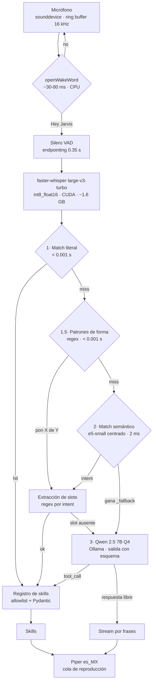

# Arquitectura

## El problema

Un asistente de voz se siente instantáneo o no se usa. El objetivo es
sub-segundo desde que dejas de hablar hasta que empieza a sonar la respuesta,
con todo corriendo en local (RTX 8 GB) y en español.

## Flujo



## Presupuesto de VRAM

| Componente | VRAM |
|---|---|
| Whisper large-v3-turbo (int8_float16) | ~1.6 GB |
| Qwen 2.5 3B Instruct (Q4_K_M) | ~2.5 GB |
| e5-small | CPU (~2 ms, no merece ocupar VRAM) |
| openWakeWord + Silero VAD + Piper | CPU |
| **Total** | **~4.1 GB** de 8 GB |

Sobran ~3.9 GB: hay margen para subir a Qwen 7B Q4 si la calidad del fallback
no alcanza.

---

## Decisiones

### Moonshine se descartó: es solo inglés

El stack inicial contemplaba Moonshine tiny (~50 ms). No tiene modelo en
español y no lo va a tener. `faster-whisper` con `large-v3-turbo` es el
reemplazo: más lento (0.12–0.25 s) pero es la única opción real, y la precisión
del STT marca el techo de todo lo demás — una palabra mal transcrita es un
comando mal enrutado.

### El LLM no está en la ruta crítica

Un LLM de 3B cuesta 0.25–0.50 s por consulta y confunde intenciones parecidas.
"Siguiente canción" no necesita razonamiento: necesita un lookup. El router
resuelve en tres etapas de coste creciente y el LLM solo ve lo que las dos
primeras no supieron.

**La métrica que gobierna la latencia media del sistema es el porcentaje de
turnos con `stage=llm`.** Si sube del 15%, al catálogo le faltan paráfrasis.

### El fuzzy matching de strings no servía

"Pasa la canción" y "siguiente canción" no comparten casi ningún carácter.
RapidFuzz les da un score bajo, así que el comando más frecuente habría caído
sistemáticamente en la ruta más lenta. Por eso la etapa 2 compara *significados*
con embeddings, no cadenas.

### Un umbral absoluto de coseno tampoco funcionaba

Fue el hallazgo que obligó a rediseñar. Medido contra este catálogo con
`intfloat/multilingual-e5-small`:

| | rango de scores |
|---|---|
| Positivos (comandos reales) | 0.856 – 0.963 |
| Negativos (charla, preguntas) | 0.809 – **0.903** |

**Se solapan.** e5 comprime todas las similitudes en una banda alta y estrecha,
así que ningún umbral separa un comando de una pregunta abierta. Dos cambios lo
arreglaron:

**1. Centrado** (`Catalog.project`). Restar el centroide del catálogo elimina la
dirección común que infla todos los cosenos. El rango útil se abre a 0.19–0.73.

**2. Clase negativa** (`_fallback` en `commands.yaml`). En vez de preguntar
"¿supera el umbral?", se pregunta "¿se parece más a un comando o a una
conversación?". La decisión pasa a ser relativa —comparación entre clases— en
lugar de absoluta, y se ajusta de forma declarativa: si una pregunta abierta se
ejecuta como comando, se añade a los ejemplos del fallback.

Resultado tras el cambio: **24/24 positivos y 8/8 negativos** correctos, con
márgenes amplios (ganador 0.34–1.00 frente a un segundo clasificado muy por
debajo). El umbral sigue existiendo pero solo como red de seguridad.

### `open.target`: apps y webs son un solo intent

Separar `app.open` de `web.open` fallaba de forma medible: "ábreme el chrome"
ganaba `web.open` con 0.942 frente a `app.open` con 0.922. Los embeddings no
tienen forma de saber si "chrome" es un programa o un sitio, porque **la
ambigüedad no es semántica sino de resolución**.

Se decide con datos en vez de con similitud:

```
allowlist de apps  →  mapa de sitios  →  búsqueda web
```

El último escalón garantiza que el comando nunca se queda sin efecto.

### El volumen del PC y el de Spotify: un slot, no dos intents

Mismo razonamiento que `open.target`, aplicado a un caso más agudo. *"Sube el
volumen"* y *"sube el volumen de Spotify"* comparten casi todas las palabras;
partirlas en dos intents las haría indistinguibles por coseno. Hay **un intent
por dirección** (subir, bajar, fijar, silenciar, consultar) y el destino viaja
como slot `target`, que por defecto vale `system`.

Cada destino tiene su mecanismo, y no se cruzan:

```
Spotify:  Web API  (el mando de dentro de la app)          — sin alternativa
PC:       IAudioEndpointVolume  →  teclas multimedia
```

Windows ofrece un segundo mando por aplicación (`ISimpleAudioVolume`, la barra
del mezclador) que **se llegó a usar para Spotify y se quitó**: es instantáneo y
no necesita autenticación, pero no es el mando que la gente quiere decir. Solo
afecta a lo que este PC saca por los altavoces, no se refleja en Spotify y no se
sincroniza con el móvil. Se paga un viaje de red por hacerlo bien.

**No hay degradación de Spotify al mezclador**, aunque sería fácil. Un fallback
que cambia *otro* volumen distinto del pedido es peor que un fallo: algo se
mueve, así que parece que funcionó.

El volumen del PC sí degrada a teclas, porque ahí ambos mecanismos mueven
exactamente el mismo mando; la única diferencia es la precisión (las teclas van
de 2% en 2%).

**Con número se fija, sin número se da un paso.** Y eso no depende de qué intent
gane: medido, *"sube el volumen al 50"* gana `volume.up` (0.635) y no
`volume.set`, porque el verbo pesa más que el número. En vez de pelear con el
router, los dos intents extraen el nivel y la skill lo prefiere sobre el paso —
la duda del router deja de tener consecuencias.

Coste medido de anclar el destino: *"termina el spotify"* se fue a `volume.mute`
(0.532 contra 0.357 de `app.close`) en cuanto se añadió *"silencia spotify"* al
catálogo. Cerrar una aplicación y silenciarla son cosas muy distintas y el
encoder no lo sabía: hubo que anclar el otro lado (`termina spotify`, `mata
spotify`), y quedó en 0.641 contra 0.524. **Es el mismo patrón que las
negaciones y las formas enclíticas: al anclar un lado, hay que medir el
opuesto.**

### Los slots se extraen después de decidir el intent

Los embeddings clasifican intenciones; no extraen parámetros. Una vez el intent
está decidido, un regex propio del intent saca el argumento. Como los regex ya
no tienen que desambiguar nada, "pon" puede aparecer en `spotify.play` y en
`open.target` sin conflicto.

Si el regex no encuentra el argumento, **solo ese caso** escala al LLM — no toda
la categoría de comandos.

Los patrones de un intent se recorren **todos**, acumulando, y para cada clave
manda el primero que la rellena. Así un intent puede repartir sus argumentos en
regex independientes —*"pon el volumen de spotify al 45"* necesita uno para el
nivel y otro para el destino— sin cambiar el comportamiento donde varios
patrones son alternativas del mismo argumento.

### Los títulos en inglés: el problema no era oír, era saber que existen

Dichos por un hispanohablante, Whisper los transcribe como suenan: *"Lovin
Machine"*, *"Ponlobes Rock"*, *"no-tinelsmatters de metálica"*. Con eso la Web
API no encuentra nada, porque no es así como están escritos.

Medido sobre 24 clips (`say` en voces ES diciendo títulos en inglés), primero
con Whisper `small` en CPU:

| Configuración | WER | Coste |
|---|---|---|
| `beam_size=1` | 39.6% | — |
| `beam_size=5` | 38.4% | +7% |
| `beam_size=1` + hotwords | **33.4%** | igual que beam=1 |
| `beam_size=5` + hotwords | 27.9% | +68% |

Parecía concluyente: los `hotwords` —los nombres de su propia biblioteca de
Spotify— arreglaban los títulos y `beam_size` no hacía nada. **Y con el modelo
real se dio la vuelta.** Los mismos 24 clips con `large-v3-turbo`:

| Configuración | WER | Exactos |
|---|---|---|
| `beam_size=1` | **22.4%** | 8/24 |
| `beam_size=5` | 21.6% | 7/24 |
| `beam_size=5` + hotwords | 24.1% | 7/24 |
| `beam_size=1` + hotwords | 24.8% | 6/24 |

Turbo ya acierta los títulos en inglés por su cuenta —la mitad del WER de
`small`—, así que el sesgo no tiene hueco donde ayudar y sí donde estorbar. Y su
modo de fallo es el peor posible: **pega el verbo al título** (*"Ponlovers Rock
de TV Girl"*), con lo que la frase ya no casa con el patrón de `spotify.play` y
el comando no llega ni a enrutarse. También convirtió un *"de Metallica"*
correcto en *", The Metallica"*.

Así que los hotwords vienen **desactivados**, con la opción disponible para
quien use otro modelo. Lo único que aguanta con los dos modelos es que **subir
`beam_size` no arregla los títulos que el modelo no conoce**: 22.4% → 21.6% es
ruido, y cuesta un 39% más de tiempo.

Lo que sí absorbe el residuo de turbo (*"TV Gery"* por *"TV Girl"*) es la
búsqueda en la biblioteca: ese par puntúa 90.9 sobre un umbral de 72.

### Y la segunda red: buscar primero en tu biblioteca

El sesgo mejora la transcripción pero no la vuelve perfecta. La otra mitad es no
depender de ella: **tus Me Gusta se buscan antes que el catálogo**. Contra unos
cientos de canciones tuyas, un emparejamiento difuso acierta donde la Web API no
tiene nada que hacer.

La similitud es el máximo de dos medidas, y la segunda no es redundante:

- `token_sort_ratio`, que ordena las palabras antes de comparar, así que da
  igual el orden o un "de" de más;
- **la misma comparación sin espacios**, porque Whisper no solo cambia letras:
  pega palabras. *"nothing else matters"* salió como *"no tinelsmatters"*, donde
  cualquier medida por tokens se hunde (`token_sort` 50.9) y sin espacios sube a
  92.0.

Medido sobre transcripciones reales: el peor acierto puntúa 91.9 y el mejor
fallo 65.0, con el umbral en 72. `token_set_ratio` **no** vale aquí aunque sí
valga para las playlists: premia las subcadenas, y con una biblioteca entera
delante *"rock"* casaría al 100 con "Lovers Rock".

### Y la tercera red: el LLM sabe cómo se escribe "TV Girl"

La biblioteca tiene un techo que no se puede subir afinando umbrales: **solo
encuentra lo que ya tienes**. Pedir algo que no está en tus Me Gusta caía a una
búsqueda con el texto destrozado, y ahí la Web API no tiene nada que hacer
porque busca letras, no fonética.

Lo que falta ahí no es una medida mejor, es **conocimiento del mundo**.
*"Tibi guerl"* solo se convierte en *"TV Girl"* si sabes que TV Girl existe, y
eso ninguna distancia de edición lo puede saber. Por eso `skills/music_ai.py`
pone al LLM local a corregir el par {título, artista} antes de volver a buscar.

**La cascada por coste es el diseño entero.** El LLM no se llama en cada
petición de música, solo cuando la vía barata ya falló:

| | Paso | Coste |
|---|---|---|
| 1 | Búsqueda directa en Spotify + verificación de cobertura | 0 ms extra |
| 2 | Emparejamiento contra tus Me Gusta (local) | 0 ms |
| 3 | El LLM corrige el nombre y se vuelve a buscar | 600–900 ms |

Es el mismo reparto que el router (literal → patrones → semántico → LLM) y que
las defensas contra el ruido: lo caro solo lo paga quien no tenía otra salida.
Sin esa condición, cada *"pon música"* que hoy ya funciona costaría casi un
segundo de más para nada. Y el reintento se limita a `no_encontrado`: sin
Spotify abierto, escribir mejor el título no arregla nada.

Esto obliga a **un solo modelo para el router y para la música**, porque en
8 GB de VRAM no caben dos: Whisper turbo 1.6 GB + qwen2.5 7B q4 4.7 GB + KV
cache 0.5 GB ≈ 6.8 GB. Se sube de 3B a 7B por una sola capa, la única que
aprovecha el tamaño; para el router daba igual, porque ahí el catálogo resuelve
la gran mayoría de los turnos en 0–2 ms.

**El catálogo de comandos no pasa por aquí, y esa mitad importa tanto como la
otra.** Para *"sube el volumen"* o *"pausa"*, el catálogo cuesta 0–2 ms, es
determinista, no puede alucinar una acción y está medido 45/45. Pasarlo por un
LLM son 250–900 ms por comando y la posibilidad de inventarse una herramienta:
peor en las tres dimensiones que importan. El LLM entra solo donde aporta algo
que el catálogo no tiene, que son los nombres propios.

#### Corregir no es inventar

La trampa de todo esto. Si el modelo no conoce la canción, no dice que no la
conoce: **produce un título plausible y distinto**, con la misma confianza. Eso
es peor que no encontrar nada, porque suena algo y parece que funcionó — el
mismo argumento por el que el volumen de Spotify no degrada al mezclador.

El prompt se lo pide (*"si no reconoces la canción, reconstruye literalmente"*),
y eso ayuda pero no basta. La defensa que sí mide algo aprovecha que **Whisper
destroza la ortografía pero conserva el sonido**: una corrección de verdad se
queda cerca del texto que se oyó, y una invención se va lejos. Es literalmente
la misma comparación que la búsqueda en la biblioteca —transcripción destrozada
contra título bien escrito— así que se usa la misma `similitud` y el mismo
umbral de 72.

Comprobado también para este uso:

| | Rango | El caso límite |
|---|---|---|
| Correcciones reales | 73.9 – 92.0 | *"blain ding lights de uiquen"* → Blinding Lights de The Weeknd (73.9) |
| Invenciones | 35.9 – 63.4 | *"loving machine de tv gery"* → Love Machine de The Miracles (63.4) |

El hueco es de 10.5 puntos y el umbral cae dentro. La asimetría es deliberada:
rechazar una corrección buena cuesta un *"no lo encontré"*, que es lo que habría
pasado sin el LLM; aceptar una mala pone a sonar una canción que nadie pidió.

Un detalle que parece un matiz y no lo es: **cuando la frase no dijo el artista,
solo se comparan los títulos**. El grupo que añade el modelo es información
nueva y no hay nada oído contra lo que contrastarla; metiéndolo en la
comparación, *"pon creep"* → *"Creep de Radiohead"* puntuaría 52.6 y se
rechazaría una corrección perfecta, solo porque el nombre del grupo es más largo
que el título.

Queda una cuarta red gratis: el nombre corregido vuelve a pasar por la
**verificación de cobertura**, así que un título inventado que además Spotify no
encuentre nunca llega a sonar.

Y el log deja la sonda funcionando sola: cada corrección descartada por
inverosímil se registra a nivel INFO. Si esa línea aparece a menudo, el modelo
no conoce lo que escuchas y está rellenando huecos.

### Hay frases sin significado que juzgar

*"Reproduce loving machine de tv girl"*. El título y el grupo son nombres
propios que el encoder no ha visto nunca: su vector es prácticamente ruido, y el
coseno lo asignaba a cualquier intent con un score mediocre.

| Frase | Ganaba | Score |
|---|---|---|
| reproduce loving machine de tv girl | `spotify.liked` | 0.461 |
| pon despacito de luis fonsi | `media.play_pause` | 0.323 |
| pon blinding lights de the weeknd | `spotify.liked` | 0.453 |

No es que falten anclas: **es que no hay nada que anclar**, porque el título
cambia en cada petición. Lo único constante de la frase es el molde.

Y tampoco lo arregla un umbral. Medido: las frases secuestradas puntúan entre
0.291 y 0.628, y las que el catálogo acierta, entre 0.290 y 0.68. Se solapan
enteras — el mismo hallazgo que hizo descartar el umbral absoluto de coseno, un
piso más arriba.

Así que la decisión se mueve a donde sí es fiable, la sintaxis: una **etapa 1.5
de patrones**, entre la literal y la semántica. Un intent declara `patterns:` en
`commands.yaml` y esos regex deciden el intent por sí solos, en 0 ms.

Lo peligroso es lo goloso: *"pon el volumen al 50"* también empieza por "pon".
Tres cosas lo contienen:

1. El patrón genérico lleva un **guardia negativo** con el vocabulario que el
   asistente ya reclama para sí (volumen, pausa, siguiente, aleatorio, mis me
   gusta…). No es una lista de frases que el usuario deba aprender, y solo crece
   cuando un intent nuevo reclama una forma con "pon".
2. **El orden de declaración manda**, así que cada intent reclama sus propias
   formas en su bloque y lo específico va antes que lo genérico. Por eso
   `spotify.liked` está declarado antes que `spotify.play`.
3. `tests/test_router.py` recorre **todas** las frases del catálogo y del corpus
   y comprueba que ningún patrón reclama las de otro intent. El guardia no puede
   quedarse obsoleto en silencio.

Lo que el regex **no** decide es el significado. *"Pon X de Y"* entrega una
hipótesis —título X, artista Y—; que eso sea de verdad una canción lo resuelve
Spotify al buscarla, y si la hipótesis parte mal la frase se reintenta entera.
Mismo reparto que en `open.target`: **la forma la reconoce el router, el sentido
lo resuelven los datos.**

### Un resultado de búsqueda tiene que cubrir lo que se pidió

`search()` siempre devuelve algo. Quedarse con el primero significaba que pedir
*"loving machine de tv girl"* reprodujera una playlist llamada "TV Girl" —dos
palabras de cuatro— y pareciera que el comando había funcionado.

Ahora se piden 5 resultados y se exige que el elegido **cubra** lo que se dijo:
qué fracción de las palabras de la petición aparece en el nombre (y en el
artista, si es una canción). Por debajo de 0.6 no se reproduce nada y se dice
que no se encontró.

La medida es **direccional** a propósito, y por eso no vale una similitud al
uso: `token_set_ratio` daba 100 tanto a *"jazz"* → "Jazz Classics" (correcto:
pediste jazz y te ponen jazz) como a *"loving machine de tv girl"* → "TV Girl"
(un desastre), porque puntúa perfecto en cuanto uno de los dos es subconjunto
del otro. Cubrir no es solaparse.

La comparación por palabra suelta usa un umbral alto (90) para absorber cómo
transcribe Whisper: a 85, "rock" casaba con "rocky" (88.9) y volvía a colarse la
banda sonora. Ser estricto ahí es barato porque la cobertura ya es una fracción
—una palabra mal transcrita de cuatro deja 0.75 y pasa igual—.

### Cerrar una app: el proceso se busca, no se deduce

`app.close` mataba `<spec.process>.exe`, y ese campo es opcional y a menudo
falso. Tres formas de fallar, las tres en silencio:

- las apps de la Microsoft Store llegan del descubrimiento con `process=None`
  (no hay forma de sacarlo del AppID) y la skill se rendía antes de intentarlo,
  aunque casi todas corren como un `.exe` normal y visible;
- los `.lnk` del menú Inicio traen un nombre **adivinado** pegando el título
  ("Visual Studio Code" → `VisualStudioCode.exe`, que no existe: es `Code.exe`);
- cuando `taskkill` fallaba, su mensaje se tiraba y el usuario oía siempre "no
  estaba abierto", tanto si no lo estaba como si el nombre era incorrecto o el
  sistema denegaba el permiso.

Ahora se construye una lista de nombres plausibles a partir de la entrada de la
allowlist —`process`, comando, clave y alias— y se **cruza con los procesos
vivos** (`tasklist`). Se mata un nombre que existe, y si no hay coincidencia se
dice que no está abierto, que es una frase distinta y accionable.

La comparación es exacta salvo mayúsculas y extensión, **sin matching difuso**:
un acierto de más aquí no abre una ventana equivocada, mata un proceso ajeno.
`Steam` contra `SteamService` está lo bastante cerca como para que cualquier
umbral difuso acabe costando trabajo sin guardar.

La frontera de seguridad no cambia: todos los candidatos salen de la config,
nunca del texto transcrito. Lo hablado solo elige **qué entrada** se usa.

### La precedencia de la config cede cuando la config no funciona

Lo declarado a mano en `apps:` gana sobre lo descubierto, con una excepción: si
el comando escrito a mano **no se puede lanzar en esta máquina**, se sustituye
por el descubierto y se avisa por log.

La precedencia existe para respetar una decisión deliberada, no para defender un
valor que no funciona. El caso se dio: `config.yaml` trae
`spotify: {command: spotify}`, que depende de que Spotify registre su clave en
App Paths. Cuando no lo hace —o la instalación es de la Store— *"abre spotify"*
no encontraba nada, mientras el descubrimiento tenía el AppID correcto y lo
estaba tirando por ser "menos prioritario".

Solo se reemplaza el comando: los alias y el nombre de proceso escritos a mano
se conservan, porque son mejores que los deducidos.

### Spotify: hay dos cosas tuyas que la búsqueda pública no ve

`search()` mira el catálogo público, y ahí no está ni tu biblioteca ni tus
listas:

- **Tus playlists.** *"Pon mi playlist de gym"* buscaba "gym" en el catálogo y
  reproducía la primera coincidencia del mundo. Hay que pedirlas por
  `current_user_playlists` (con los permisos `playlist-read-private` y
  `playlist-read-collaborative`) y emparejarlas por nombre. El emparejamiento
  usa `token_set_ratio` y no `WRatio`: con este último, "rock" casaba al 90 con
  una playlist llamada "Rocky soundtrack" por ser subcadena.
- **Tus Me Gusta.** No son una playlist y no tienen `context_uri`: arrancarlos
  como contexto es un 404. Hay que leer `current_user_saved_tracks` y pasar la
  lista de URIs.

El artista viaja en su propio slot y cambia la búsqueda entera: con artista se
usan filtros de campo (`track:"X" artist:"Y"`) y se salta la cascada
playlist→álbum→canción, porque *"pon la canción X de Y"* no puede acabar en una
playlist llamada X.

El molde "pon la canción X de Y" necesitó **nueve anclas** en el catálogo. Lo
único estable de esa frase es la sintaxis: un título desconocido es casi ruido
para el encoder, y con tres anclas *"pon la canción labios compartidos de maná"*
ganaba a `spotify.like` por 0.012 — perder ahí no habría sido un "no entiendo",
sino guardar en favoritos la canción que ya sonaba.

### `SendInput` y el tamaño de `INPUT`

`SendInput` exige que `cbSize` sea exactamente `sizeof(INPUT)`: 40 bytes en x64.
El tamaño lo fija `MOUSEINPUT` (32 bytes), no `KEYBDINPUT` (24), así que declarar
la unión solo con el miembro que se usa da 32 y Windows rechaza la llamada
entera devolviendo 0.

Es un fallo silencioso por partida doble: no lanza excepción, y el respaldo por
teclas solo se ejercita cuando la Web API de Spotify ya ha fallado, así que
puede pasar meses sin manifestarse. `tests/test_winkeys.py` fija el tamaño y el
motivo.

### Seguridad: el LLM nunca genera código

El registro de skills es la única puerta hacia la ejecución y aplica dos
controles: allowlist por nombre (sin resolución dinámica, sin `getattr`, sin
import por nombre) y validación Pydantic con `extra="forbid"` en cada modelo de
argumentos.

Lo peor que puede hacer un modelo confundido —o alguien que grite un comando
cerca del micrófono— es disparar una acción que ya estaba autorizada. Las apps
que se pueden abrir y cerrar están en `config.yaml`; lo que no esté ahí no
existe. Cubierto por `tests/test_registry.py`.

### Silero VAD: dos versiones con APIs incompatibles

El modelo que trae openWakeWord es el **v4** (`input`, `sr`, `h`, `c` — estados
LSTM separados de forma `(2, batch, 64)`, frames de 1536 muestras). El v5 usa un
estado unificado de 128 y frames de 512. Pasar el feed equivocado da un
`ValueError: Required inputs (['h', 'c']) are missing` que no menciona versiones
en ningún momento.

`vad.py` detecta la versión leyendo los nombres de las entradas del modelo, en
vez de asumir una. Como efecto secundario, el frame pasa a 96 ms en v4, lo que
destapó un fallo de contabilidad en el endpointing: los bloques sin lectura
completa no contaban como silencio y el corte llegaba tarde. Cubierto ahora por
`tests/test_recorder.py`.

### Modelos calientes desde el arranque

La primera inferencia en CUDA compila kernels y cuesta segundos. Todos los
modelos se cargan y se calientan con inferencia sintética antes de empezar a
escuchar, y Ollama corre con `keep_alive: -1` para que el modelo no se descargue
nunca de VRAM.

### Correr de fondo: `pythonw.exe`, no un binario empaquetado

Un asistente de voz que hay que arrancar desde una terminal y dejar la ventana
abierta no se usa. Pero quitar la consola invalida tres supuestos del código, y
los tres fallan **en silencio**, que es lo que los hace peligrosos:

| Lo que se pierde | Lo que rompe | Dónde se arregla |
|---|---|---|
| `sys.stdout` / `sys.stderr` valen `None` | el registro entero se perdía y el asistente parecía ir bien | `logsetup.py`: fichero rotativo + redirección de los `None` |
| el directorio de trabajo es arbitrario | ninguna ruta relativa resuelve: config, comandos, voz de Piper | `runtime.anchor_working_directory()` |
| no hay Ctrl-C | el bucle no tenía forma de terminar | evento de parada en `pipeline.py` + `tray.py` |

**Por qué no PyInstaller.** `cuda_setup.py` localiza las DLL de cuBLAS y cuDNN
en tiempo de ejecución recorriendo `site.getsitepackages()`. Dentro de un
binario congelado no hay site-packages, así que el STT caería con
`cublas64_12.dll is not found`. Arreglarlo obliga a reescribir `cuda_setup` para
el modo congelado y a empotrar ~2 GB de DLL de NVIDIA. Un acceso directo a
`pythonw.exe` da el mismo doble clic sin ventana, sigue usando el venv real —un
`pip install` surte efecto sin reempaquetar— y cuesta un script.

**Por qué la carpeta de Inicio y no el Programador de tareas.** El Programador
puede ejecutar antes de que la sesión esté montada, y ahí el proceso no tiene
acceso al micrófono ni al dispositivo de audio predeterminado. La carpeta de
Inicio arranca dentro de la sesión del usuario, que es donde vive el micrófono,
y no pide permisos de administrador.

**Por qué instancia única.** Dos copias abren las dos el micrófono, así que cada
orden se ejecuta dos veces, y cargan dos veces Whisper sobre un presupuesto que
ya va al 85%. El síntoma —"va lentísimo y repite todo"— no apunta a la causa.
El guardia es un mutex con nombre del kernel y no un fichero con el PID: si el
proceso muere de forma brusca, el kernel lo libera solo, mientras que un fichero
se queda ahí y bloquea todos los arranques siguientes.

**El icono tiene que confirmar que existe.** `Tray.start()` devolvía `True` en
cuanto arrancaba el hilo de `pystray`. Pero el icono se crea *dentro* de ese
hilo, así que cualquier fallo ahí —backend que no arranca, bandeja que rechaza
el icono— ocurría después de que `start()` hubiera dicho que sí, y el
`threading` por defecto se comía la excepción. Resultado: el asistente creía
tener icono, el usuario no lo tenía y no había una línea en el registro que lo
dijera. Ahora `start()` espera a que `pystray` llame a su callback de arranque,
y si no llega —o si revienta— devuelve `False` **con el motivo**, que se le
enseña al usuario con un cuadro de diálogo cuando no hay consola. Quedarse sin
icono no impide asistir, pero deja el proceso sin más forma de pararse que el
Administrador de tareas, y eso no puede enterarse uno leyendo un fichero de log
que no sabe que existe.

### La ventana de seguimiento: qué sustituye a la palabra clave

Repetir *"Apolo"* para cada paso de volumen convierte un ajuste de tres
segundos en uno de quince. Tras cada orden el asistente sigue escuchando 5 s
sin exigir la clave, y cada orden aceptada renueva el plazo.

El problema es lo que se está quitando: **la palabra clave es la única defensa
real contra ejecutar lo que se oye de la televisión**. El router no la
sustituye —su trabajo es elegir el mejor intent, no decidir si le hablaban a
él—, así que dentro de la ventana hacen falta otros filtros. Son tres, y tienen
que pasar los tres:

| Filtro | Qué descarta | Por qué ese |
|---|---|---|
| allowlist `follow_up.tools` | abrir apps, buscar en la web, poner una canción | acota el **daño**, no la probabilidad |
| etapa del router ≠ `llm` | conversación ajena | si hizo falta el modelo, no era una orden simple; y la clase `_fallback` manda ahí todo lo que no parece un comando |
| verificación de locutor | otras voces | aquí **sí** se aplica, al revés que en el turno normal: allí acababas de decir la clave, aquí no ha dicho nada nadie |

El criterio de la allowlist es explícito y está escrito como test: *si la tele
lo dispara, ¿se deshace hablando?* Reproducción y volumen sí —el peor caso es
que salte una canción y digas "anterior"—; `open.target` abriría ventanas
encima de lo que estés haciendo y no.

**Oírse a sí mismo era el fallo que la hacía inútil.** El callback del driver de
audio no para nunca: mientras Piper habla por los altavoces, la voz del propio
asistente se encola en el buffer del micrófono (que aguanta ~5 s). Con palabra
clave eso era inofensivo —el asistente no dice "Apolo"—, pero sin ella se
transcribiría a sí mismo y se contestaría solo. Por eso la ventana espera a que
el TTS termine **y** vacía el buffer (`MicrophoneStream.discard_pending()`)
antes de volver a escuchar. El plazo empieza a contar cuando calla, no cuando
termina de ejecutar: si no, una confirmación de dos segundos se comería media
ventana.

Cada frase rechazada se registra **con el motivo**, no como "ignorada" a secas.
Es la diferencia entre poder ajustar esto y tener que adivinar: el motivo dice
si a la allowlist le falta un nombre o si la ventana está recogiendo
conversación y hay que acortarla.

---

## Mediciones

En CPU de macOS (Apple Silicon). Las capas que dependen de CUDA siguen sin medir.

| Etapa | Coste | Nota |
|---|---|---|
| Router literal | 0.00 ms | lookup de diccionario |
| Router semántico | **2.09 ms** p50 | 115 anclas; se estimaban 10–20 ms |
| Wake word | 1.19 ms | por bloque de 80 ms → ~1.5% de un núcleo |
| VAD Silero | 0.11 ms | por bloque de 80 ms |
| TTS Piper (en frío) | 555 ms | **primera** síntesis |
| TTS Piper (en caliente) | 43–69 ms | tras el warmup |

**El calentamiento importa en las tres capas, no solo en CUDA.** Piper pasa de
555 ms a ~65 ms tras la primera síntesis: un factor de 9. Sin warmup, la primera
respuesta hablada llega medio segundo tarde justo cuando más se nota. Lo mismo
con Whisper (compilación de kernels) y con Ollama (carga de 2.5 GB a VRAM, **42.8 s
medidos en el PC Windows** con el disco frío).

Calidad de voz: `es_MX-claude-high` y `es_MX-ald-medium` tardan lo mismo en
caliente (62 vs 69 ms), así que no hay razón para bajar de `high`.

Silero VAD sobre voz real sintetizada con Piper: máximo 1.000, media 0.858.
Sobre silencio: 0.059. El umbral de 0.5 queda bien centrado entre ambos.

**Dónde está realmente la latencia.** El silencio que hay que esperar para dar
la frase por terminada (`vad.silence_s`, 0.35 s) es el 40–50% del total: más que
el STT y el router juntos. Es el primer y más rentable parámetro a tunear.

## Pendiente de medir en el PC Windows

Nada de lo que toca micrófono, CUDA, `pycaw` o `SendInput` se ha ejecutado
todavía. En concreto: la latencia real de Whisper turbo en la GPU, el
endpointing del VAD con el micrófono real, la tasa de falsos positivos del wake
word, y el porcentaje real de comandos que escalan al LLM en uso diario.
